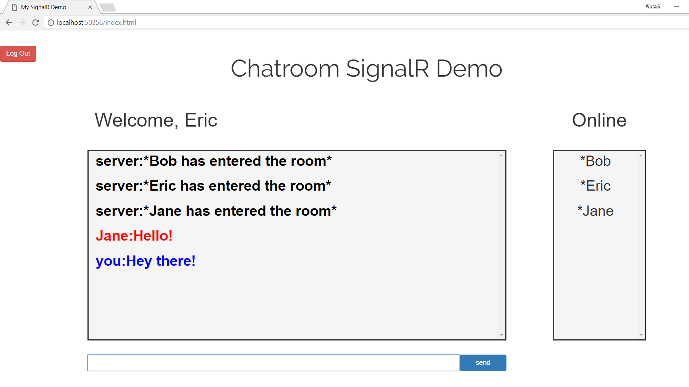

# SignalRChat
Simple AngularJS that uses SignalR to implement a Chatroom on localhost  

## Viewing Source Code  
* SignalRDemo/index.html: html page of application  
* SignalRDemo/app.js: contains AngularJS controllers and main logic  
* SignalRDemo/angularjs-services/signalr-service.js: implements SignalR in my application  
* SignalRDemo/Hub/ChatHub.cs: My Hub Class  
## Possible Additions     
1. use signalr wrapper  
   link: https://github.com/JustMaier/angular-signalr-hub  
1. Add Entity Framework/ Database Functionality  
## Screenshot  
  
